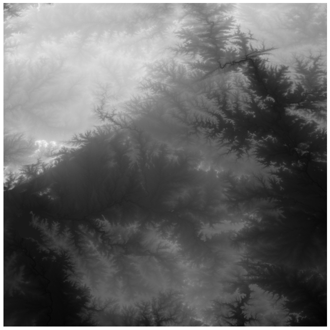
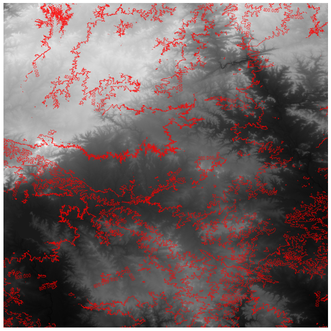
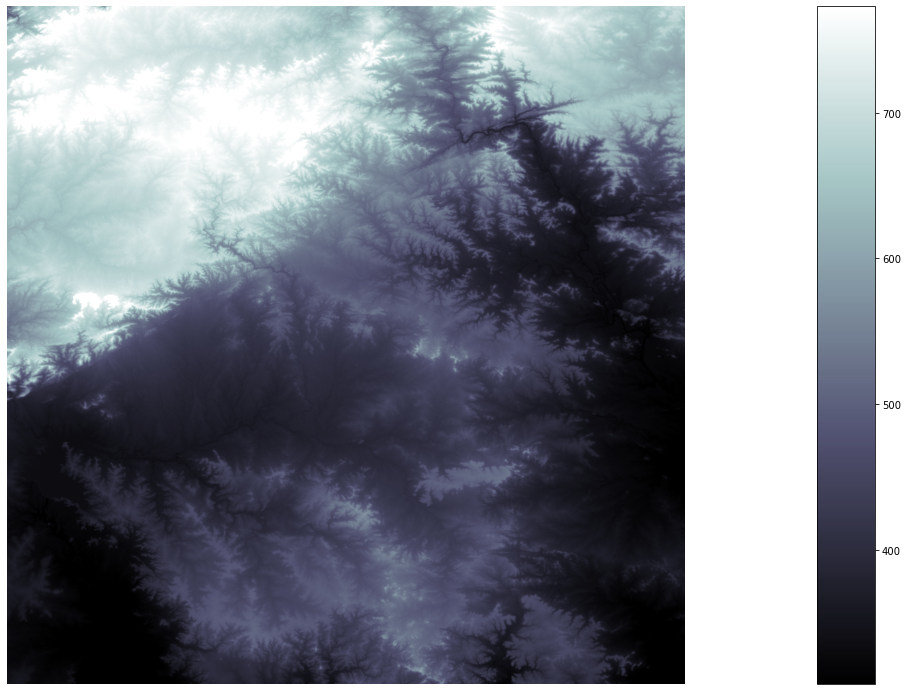
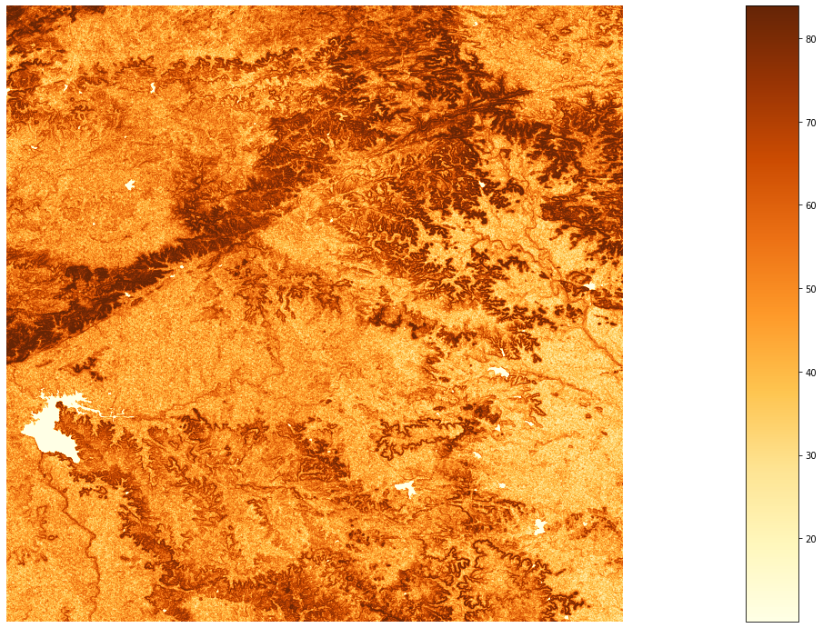
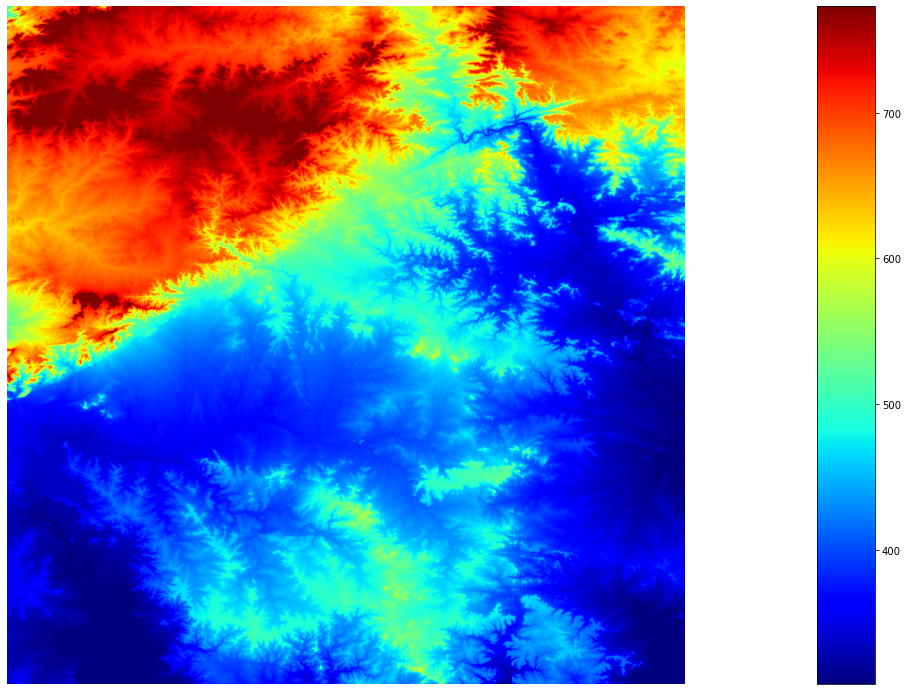

## CHAPTER 4: DEM Analysis of my hometown Nagpur, using Rasterio package

The following is a project executed by Rishabh Jain in Jupyter notebook, for visualsing and analysing digital elevation model data in python using an open source library Rasterio. The data used for the same is downloaded from Earth Explorer made freely available by USGS

## Installing all the libraries


```python
pip install rasterio
```

    Requirement already satisfied: rasterio in c:\programdata\anaconda3\lib\site-packages (1.3.5)
    Requirement already satisfied: cligj>=0.5 in c:\programdata\anaconda3\lib\site-packages (from rasterio) (0.7.2)
    Requirement already satisfied: numpy>=1.18 in c:\programdata\anaconda3\lib\site-packages (from rasterio) (1.19.2)
    Requirement already satisfied: attrs in c:\programdata\anaconda3\lib\site-packages (from rasterio) (20.3.0)
    Requirement already satisfied: certifi in c:\programdata\anaconda3\lib\site-packages (from rasterio) (2020.6.20)
    Requirement already satisfied: click>=4.0 in c:\programdata\anaconda3\lib\site-packages (from rasterio) (7.1.2)
    Requirement already satisfied: affine in c:\programdata\anaconda3\lib\site-packages (from rasterio) (2.4.0)
    Requirement already satisfied: setuptools in c:\programdata\anaconda3\lib\site-packages (from rasterio) (50.3.1.post20201107)
    Requirement already satisfied: snuggs>=1.4.1 in c:\programdata\anaconda3\lib\site-packages (from rasterio) (1.4.7)
    Requirement already satisfied: click-plugins in c:\programdata\anaconda3\lib\site-packages (from rasterio) (1.1.1)
    Requirement already satisfied: pyparsing>=2.1.6 in c:\programdata\anaconda3\lib\site-packages (from snuggs>=1.4.1->rasterio) (2.4.7)
    Note: you may need to restart the kernel to use updated packages.
    

    WARNING: Ignoring invalid distribution -mpy (c:\programdata\anaconda3\lib\site-packages)
    WARNING: Ignoring invalid distribution -umpy (c:\programdata\anaconda3\lib\site-packages)
    WARNING: Ignoring invalid distribution -mpy (c:\programdata\anaconda3\lib\site-packages)
    WARNING: Ignoring invalid distribution - (c:\programdata\anaconda3\lib\site-packages)
    WARNING: Ignoring invalid distribution -mpy (c:\programdata\anaconda3\lib\site-packages)
    WARNING: Ignoring invalid distribution -umpy (c:\programdata\anaconda3\lib\site-packages)
    WARNING: Ignoring invalid distribution -mpy (c:\programdata\anaconda3\lib\site-packages)
    WARNING: Ignoring invalid distribution - (c:\programdata\anaconda3\lib\site-packages)
    WARNING: Ignoring invalid distribution -mpy (c:\programdata\anaconda3\lib\site-packages)
    WARNING: Ignoring invalid distribution -umpy (c:\programdata\anaconda3\lib\site-packages)
    WARNING: Ignoring invalid distribution -mpy (c:\programdata\anaconda3\lib\site-packages)
    WARNING: Ignoring invalid distribution - (c:\programdata\anaconda3\lib\site-packages)
    WARNING: Ignoring invalid distribution -mpy (c:\programdata\anaconda3\lib\site-packages)
    WARNING: Ignoring invalid distribution -umpy (c:\programdata\anaconda3\lib\site-packages)
    WARNING: Ignoring invalid distribution -mpy (c:\programdata\anaconda3\lib\site-packages)
    WARNING: Ignoring invalid distribution - (c:\programdata\anaconda3\lib\site-packages)
    WARNING: Ignoring invalid distribution -mpy (c:\programdata\anaconda3\lib\site-packages)
    WARNING: Ignoring invalid distribution -umpy (c:\programdata\anaconda3\lib\site-packages)
    WARNING: Ignoring invalid distribution -mpy (c:\programdata\anaconda3\lib\site-packages)
    WARNING: Ignoring invalid distribution - (c:\programdata\anaconda3\lib\site-packages)
    WARNING: Ignoring invalid distribution -mpy (c:\programdata\anaconda3\lib\site-packages)
    WARNING: Ignoring invalid distribution -umpy (c:\programdata\anaconda3\lib\site-packages)
    WARNING: Ignoring invalid distribution -mpy (c:\programdata\anaconda3\lib\site-packages)
    WARNING: Ignoring invalid distribution - (c:\programdata\anaconda3\lib\site-packages)
    
    [notice] A new release of pip available: 22.3.1 -> 23.0
    [notice] To update, run: python.exe -m pip install --upgrade pip
    


```python
import numpy as np
import rasterio as rio
from rasterio.plot import show
import matplotlib.pyplot as plt

```

## Uploading the data in tif format


```python
dem = rio.open("nagpur.tif")
dem_array = dem.read(1).astype('float64')

```

## Displaying uploaded DEM image


```python
fig, ax = plt.subplots(1, figsize=(12, 12))
show(dem_array, cmap='Greys_r', ax=ax)
plt.axis('off')
plt.show()
```


    

    


## Displaying DEM image with Contour maps


```python
fig, ax = plt.subplots(1, figsize=(12, 12))
show(dem_array, cmap='Greys_r', ax=ax)
show(dem_array, contour=True, ax=ax, linewidths=0.7)
plt.axis("off")
plt.show()
```


    

    


## DEM Visualisation with RichDEM package#


```python
import richdem as rd
dem_richdem = rd.rdarray(dem_array, no_data=-9999)
```


```python
fig = rd.rdShow(dem_richdem, axes=False, cmap="bone", figsize=(16, 10)); 
fig 

```


    

    


    {'vmin': 308.0, 'vmax': 773.0}


```python
dem_slope = rd.TerrainAttribute(dem_richdem, attrib="slope_degrees") 
rd.rdShow(dem_slope, axes=False, cmap="YlOrBr", figsize=(16, 10));
```

    Warning! No geotransform defined. Choosing a standard one! (Top left cell's top let corner at <0,0>; cells are 1x1.)
    Warning! No geotransform defined. Choosing a standard one! (Top left cell's top let corner at <0,0>; cells are 1x1.)
    


    

    


## Slope Visualisation with heatmap


```python
dem_filled = rd.FillDepressions(dem_richdem, in_place=False) 
dem_filled_fig = rd.rdShow(dem_filled, ignore_colours=[0], axes=False, cmap="jet", 
vmin=fig["vmin"], vmax=fig["vmax"], figsize=(16,10))

```

    Warning! No geotransform defined. Choosing a standard one! (Top left cell's top let corner at <0,0>; cells are 1x1.)
    


    

    

